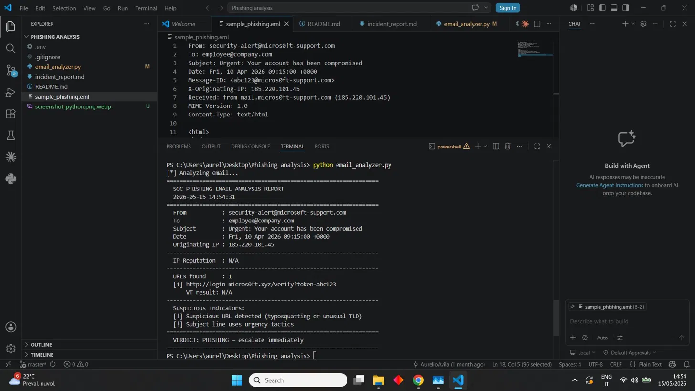

# Phishing Email Analysis — SOC Home Lab

[](https://github.com/AurelioAvila/phishing-email-analysis/actions/workflows/ci.yml)

A Tier 1 SOC analyst workflow for triaging suspicious emails: parsing `.eml`
files, extracting Indicators of Compromise (IOCs), and enriching them with
threat intelligence from the VirusTotal v3 API.

> **Note:** This is a home-lab portfolio project. The analysis sample
> (`sample_phishing.eml`) is fictitious and built for demonstration purposes.

---

## Scenario

A user reports a suspicious email claiming to be from Microsoft Security,
urging immediate action to verify account credentials via an external link.
The analyst's job is to confirm whether the email is phishing, extract
actionable IOCs, and produce an incident report.

## Workflow

1. Parse email headers to extract sender, originating IP, subject, and metadata
2. Extract URLs from both HTML and plain-text body parts
3. Query VirusTotal v3 for IP and URL reputation
4. Apply heuristic rules to flag typosquatting, suspicious TLDs, and urgency language
5. Produce a verdict (PHISHING / CLEAN) and document findings

---

## 🎯 MITRE ATT&CK Mapping

| Technique | ID | Tactic |
|-----------|-----|--------|
| Phishing: Spearphishing Link | [T1566.002](https://attack.mitre.org/techniques/T1566/002/) | Initial Access (TA0001) |
| Valid Accounts | [T1078](https://attack.mitre.org/techniques/T1078/) | Defense Evasion / Persistence |

---

## Tools

- **Python 3** — email parsing, IOC extraction, threat-intel enrichment
- **VirusTotal API v3** — IP and URL reputation
- **python-dotenv** — secure handling of API keys via environment variables
- **requests** — HTTP client

## Repository Structure

    phishing-email-analysis/
    ├── email_analyzer.py        # main analysis script
    ├── sample_phishing.eml      # fictitious phishing sample for testing
    ├── incident_report.md       # analyst write-up with IOCs and recommendations
    ├── .env.example             # template for API key configuration
    ├── .gitignore               # excludes .env and other sensitive files
    └── README.md

## Setup

### 1. Clone the repository

```bash
git clone https://github.com/AurelioAvila/phishing-email-analysis.git
cd phishing-email-analysis
```

### 2. Install dependencies

```bash
pip install requests python-dotenv
```

### 3. Configure your VirusTotal API key

```bash
cp .env.example .env
```

Then edit `.env` and paste your VirusTotal API key:

```
VT_API_KEY=your_real_virustotal_api_key_here
```

> Get a free API key at [virustotal.com](https://www.virustotal.com/gui/my-apikey)

### 4. Run the analyzer

```bash
python email_analyzer.py sample_phishing.eml
```

If no file is provided, the script defaults to `sample_phishing.eml`.

---

## 📸 Screenshot



---

## Detection Logic

The script combines two layers:

**Heuristic detection** (works offline, fast):

- Typosquatting in sender domain (`micros0ft` vs `microsoft`)
- Suspicious TLDs (`.xyz`, `.top`, `.click`, `.tk`, `.gq`, `.cf`)
- Typosquatted brand names in URLs
- Urgency language in subject (`URGENT`, `verify`, `suspended`, `compromised`, etc.)

**Threat intelligence enrichment** (requires VirusTotal):

- Originating IP reputation lookup
- URL reputation lookup with VT v3 base64-url encoding
- Combined verdict based on engine flag counts

## Limitations

- VirusTotal free tier allows 4 requests per minute. The script waits 15
  seconds between URL lookups to respect the rate limit.
- The heuristic brand list is small by design (Microsoft, Google, PayPal,
  Amazon, Apple, Netflix). Extending it is straightforward.
- The analyzer is static: it does not detonate attachments or follow links.
- No DKIM / SPF / DMARC validation yet (planned improvement).

## Planned Improvements

- DKIM / SPF / DMARC header validation
- Attachment hash extraction and VT lookup
- YARA rule integration for body content patterns
- Export findings as JSON for downstream tooling (TheHive, MISP)

---

## Disclaimer

This project is for educational and portfolio purposes only.
The sample email is fictitious. The script must never be used against
emails or infrastructure for which you do not have explicit authorization.

---

## 🔗 Related Projects

| Project | Description |
|---------|-------------|
| [detection-engineering-rules](https://github.com/AurelioAvila/detection-engineering-rules) | YARA + Sigma detection rules validated against synthetic true/false-positive test cases |
| [ransomware-dfir-timeline](https://github.com/AurelioAvila/ransomware-dfir-timeline) | Multi-source DFIR timeline reconstruction of a ransomware incident, MITRE-mapped, full analyst write-up |
| [soc-home-lab](https://github.com/AurelioAvila/soc-home-lab) | End-to-end SOC lab with Wazuh + OpenSearch, MITRE-mapped detection & triage |
| [malware-triage-hash](https://github.com/AurelioAvila/malware-triage-hash) | Python SHA256 triage via VirusTotal API + Sentinel KQL hunt rule |
| [splunk-brute-force-detection](https://github.com/AurelioAvila/splunk-brute-force-detection) | Brute force detection with Splunk SPL |
| [network-traffic-analysis](https://github.com/AurelioAvila/network-traffic-analysis) | Python + Scapy PCAP analyzer with MITRE mapping |
